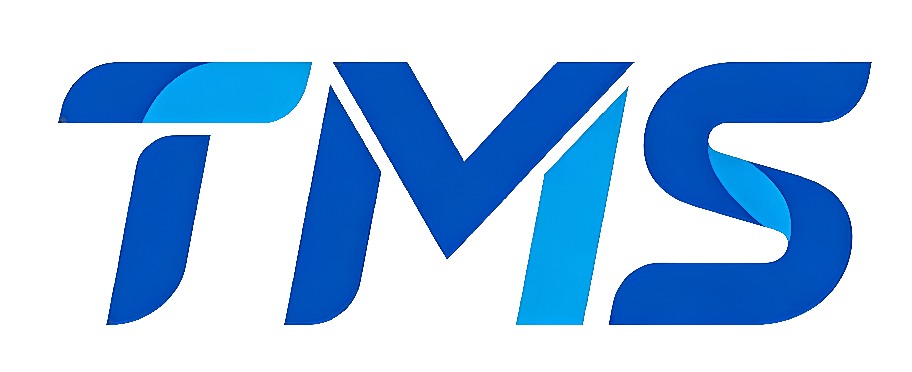
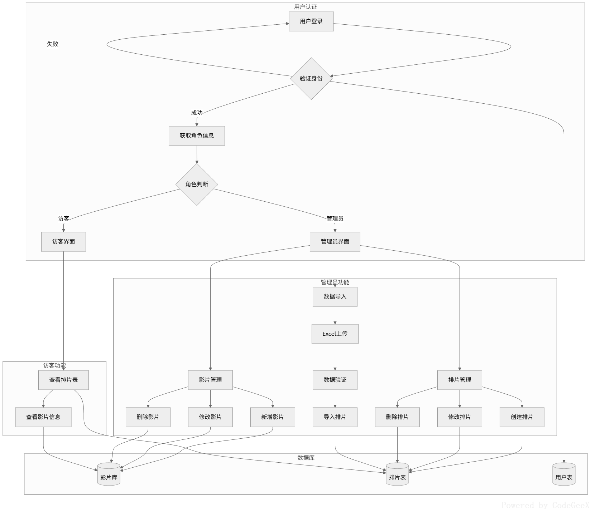

# 🎬 CustomTMS

**CustomTMS** 是一个轻量、可定制的 **影院 TMS 排期预览与管理系统**，专注解决影院排片中常见但容易被忽略的复杂问题，例如：

- 跨日（0 点）场次处理
- 场次时间冲突校验
- 拖拽式排片交互

项目围绕「**真实业务逻辑**」进行设计，强调 **可读性、可维护性与工程合理性**，适合作为 **开源学习参考** 或 **中后台系统设计示例**。

------

## 📌 项目定位说明

- ❌ **不涉及** 放映服务器、放映机、DCP 等底层放映系统交互
- ✅ 专注于 **优化影院普通员工的日常排片与管理工作流**
- ✅ 作为独立的排片管理工具或上层业务系统使用

------

## 🔧 二次开发说明

- 本项目支持 **Clone 后进行二次开发与功能扩展**
- 适用于根据不同影院业务进行定制化改造

------

## 📄 开源协议

- 本仓库采用 **MIT License**
- 允许自由使用、修改与分发
- **二次创作需在控制台（Console）中保留并输出：**
	- 原作者信息
	- 本仓库 GitHub 地址


### 🎞 真实排片逻辑

- 支持 **跨 0 点场次**（自动识别次日）
- 场次结束时间自动计算
- 明确区分「展示日期」与「自然日期」
- 跨日场次自动标识 `+1 天`

### ⏱ 场次冲突校验

- 后端统一时间冲突校验
- 避免同一影厅出现重叠场次
- 防止“看起来没问题、实际会撞场”的隐患

### 🧲 拖拽式排片

- 基于 `Sortable.js`
- 支持影片列表 → 排片区域拖拽
- 使用克隆拖拽，不破坏原始数据
- 修复拖拽过程中 `dataset` 丢失导致的交互异常

### 🔐 权限控制

- 基于角色的接口访问控制
- 非管理员用户自动拦截关键操作
- 后端校验，不依赖前端“假限制”

---

## 🛠 技术栈

### 前端

- Vue 3
- Element Plus
- Sortable.js
- Day.js

### 后端

- Node.js
- Express
- MySQL 5.7 / 5.5
- JWT 鉴权

### 其他

- Nginx
- 支持 Docker 化部署（可扩展）

---

## 📁 项目结构说明（简要）



---

## 🚀 本地运行

```bash
# 后端
npm install
nodemon ./app.js

# 前端
npm install
npm run dev
```

> 数据库初始化请参考 `SQL` 目录
>
> **注意： SQL的设计版本是基于mysql5.7.4如果你的mysql低于这个版本。**
>
> ```sql
> `created_at` datetime DEFAULT CURRENT_TIMESTAMP,
> `updated_at` datetime DEFAULT CURRENT_TIMESTAMP ON UPDATE CURRENT_TIMESTAMP,
> ```
>
> **这两个部分的** ***CURRENT_TIMESTAMP*** **一定要改！不然无法导入低于mysql 5.7.4以下的数据库**

---

## 🧠 设计原则

- **时间统一用时间戳计算，避免字符串陷阱**
- **核心业务逻辑后端兜底**
- **前端只负责展示与交互**
- **拒绝“为了演示而写的假逻辑”**

---

## 📌 适合谁？

- 想学习 **复杂时间业务处理** 的开发者
- 想参考 **Vue3 + Element Plus 中后台实践**
- 想了解 **拖拽交互在真实业务中的落地方式**
- 不想看“只有界面、没有灵魂”的 Demo 项目的人

---

## 📄 License

MIT License

---

### 🧩 说明

本项目为 **个人开源项目**，源于实际需求抽象，欢迎 Issue、PR 与讨论。

---
